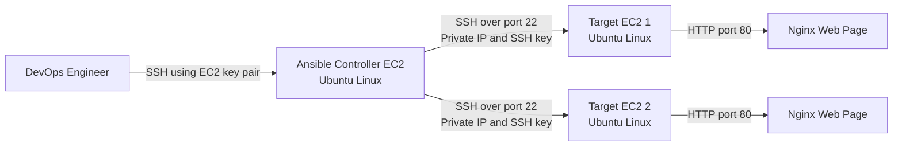

# Architecture: Ansible-Based Nginx Deployment on AWS EC2

## 1. Project Overview

This project demonstrates how an Ansible Controller can configure multiple Ubuntu target servers hosted on AWS EC2. Ansible connects to the target servers through SSH key-based authentication, installs and manages Nginx, and deploys a custom web page.

The project follows a controller-to-managed-node architecture:

- The **Controller EC2 instance** stores the Ansible inventory, project files, and playbook.
- The **Target EC2 instances** are managed remotely by Ansible.
- SSH provides secure communication between the controller and targets.
- Nginx runs on each target and serves the deployed web page.

## 2. Architecture Diagram



## 3. Component Responsibilities

### DevOps Engineer Workstation

- Connects to the Ansible Controller using the controller's public IP and the AWS EC2 private key file.
- Creates and maintains the inventory, Ansible playbook, website files, and project documentation.
- Runs Ansible commands and playbooks from the Controller.

### Ansible Controller EC2

- Runs Ubuntu Linux and Ansible.
- Stores the controller's SSH private key securely.
- Stores the inventory containing target private IP addresses.
- Executes Ansible modules and playbooks against the target group.
- Sends the custom `index.html` file to the Nginx document root on each target.

### Target EC2 Instances

- Run Ubuntu Linux.
- Store the Controller's public key in `/home/ubuntu/.ssh/authorized_keys`.
- Accept SSH connections from the Controller.
- Receive configuration changes from Ansible.
- Run Nginx and serve the deployed web page.

## 4. Network and Access Flow

1. The engineer connects from the local workstation to the Controller EC2 instance using SSH.
2. The Controller reads target server details from the Ansible inventory.
3. The Controller connects to each target's private IP on TCP port 22.
4. The Target validates the Controller using the public key stored in `authorized_keys`.
5. Ansible runs the required modules on the Target.
6. Nginx serves the custom page over TCP port 80.
7. A browser can access the page through the Target's public IP when the security group permits HTTP access.

## 5. Security Group Design

### Controller Security Group

- Allow inbound SSH on TCP port 22 only from the engineer's trusted public IP.
- Allow outbound SSH to the target servers.

### Target Security Group

- Allow inbound SSH on TCP port 22 only from the Controller security group or the Controller's private IP.
- Allow inbound HTTP on TCP port 80 only from the required testing source. For a public portfolio demonstration, this may temporarily be configured for public access.
- Do not expose SSH on port 22 to `0.0.0.0/0` in a production-style setup.

## 6. SSH Authentication Flow

```text
Controller private key: ~/.ssh/id_ed25519
Controller public key:  ~/.ssh/id_ed25519.pub
Target trust file:      ~/.ssh/authorized_keys
```

Authentication sequence:

1. The key pair is generated on the Controller.
2. The Controller's public key is appended to the Target's `authorized_keys` file.
3. The private key remains only on the Controller and must not be copied to the Target or committed to GitHub.
4. When Ansible connects, the Controller proves its identity using the private key.
5. The Target permits access when the matching public key exists in `authorized_keys`.

## 7. Ansible Inventory Design

Example inventory:

```ini
[web]
target1 ansible_host=172.31.31.6 ansible_user=ubuntu ansible_python_interpreter=/usr/bin/python3
target2 ansible_host=172.31.8.59 ansible_user=ubuntu ansible_python_interpreter=/usr/bin/python3
```

Purpose of the inventory:

- Groups servers by role.
- Stores target connection details.
- Allows the same automation to run against one server, one group, or all managed servers.
- Pins the Python interpreter path to avoid interpreter-discovery warnings when appropriate for the target image.

Private IP addresses in public repositories should be replaced with examples or variables when necessary.

## 8. Automation Workflow

```text
Inventory validation
        ↓
Ansible connectivity test
        ↓
Update APT package cache
        ↓
Install Nginx
        ↓
Start and enable Nginx
        ↓
Deploy custom index.html
        ↓
Verify service and webpage
```

Recommended commands:

```bash
ansible-inventory -i inventory --graph
ansible web -i inventory -m ping
ansible-playbook -i inventory playbooks/nginx_setup.yml --check
ansible-playbook -i inventory playbooks/nginx_setup.yml
ansible web -i inventory -m command -a "systemctl is-active nginx"
```

## 9. Configuration Management Principles Demonstrated

### Agentless Management

The target servers do not require an Ansible agent. The Controller manages them over SSH.

### Idempotency

Ansible describes the required end state. For example, `state: present` ensures that Nginx is installed without repeatedly reinstalling it when the playbook runs again.

### Repeatability

The same playbook can configure additional target servers after their addresses are added to the inventory.

### Scalability

Hosts can be organized into groups such as `web`, `database`, and `development`, allowing tasks to be applied only to the required systems.

### Version Control

The inventory template, playbook, HTML file, and documentation can be stored in GitHub. Secrets and private keys must remain outside the repository.

## 10. Repository Mapping

```text
ansible-nginx-deployment/
├── README.md
├── ansible.cfg
├── inventory
├── .gitignore
├── playbooks/
│   └── nginx_setup.yml
├── files/
│   └── index.html
├── docs/
│   └── architecture.md
└── screenshots/
    ├── 01-ansible-ping.png
    ├── 02-playbook-run.png
    └── 03-webpage-output.png
```

## 11. Secrets and Files That Must Not Be Committed

Add the following rules to `.gitignore`:

```gitignore
*.pem
*.key
id_rsa
id_rsa.pub
id_ed25519
id_ed25519.pub
*.retry
.vault_pass
```

Do not commit:

- AWS `.pem` files
- SSH private keys
- Ansible Vault passwords
- Cloud credentials or access tokens
- Public IP addresses when they should remain private
- Passwords embedded in inventory or playbooks

## 12. Failure and Troubleshooting Flow

If an Ansible task fails:

1. Validate that the target IP is correct in the inventory.
2. Confirm network access to TCP port 22.
3. Test direct SSH from the Controller to the Target.
4. Run the Ansible ping module.
5. Verify the remote user and SSH key permissions.
6. Confirm Python is available on the Target.
7. Re-run the command with verbose output using `-vvv`.
8. Review the failed task output before applying a fix.

Example diagnostics:

```bash
ssh ubuntu@<target-private-ip>
ansible web -i inventory -m ping
ansible web -i inventory -m ping -vvv
```

## 13. Future Enhancements

- Replace ad hoc commands with reusable Ansible roles.
- Use Jinja2 templates for Nginx configuration.
- Add handlers to restart Nginx only when configuration changes.
- Encrypt sensitive variables using Ansible Vault.
- Provision EC2 instances and security groups using Terraform.
- Use a bastion host or AWS Systems Manager for controlled administrative access.
- Add validation tasks and CI checks for Ansible syntax and YAML formatting.
- Deploy the same architecture across development, testing, and production inventories.

## 14. Project Outcome

The completed setup demonstrates an end-to-end configuration-management workflow in which an Ansible Controller securely connects to AWS EC2 target servers, applies a consistent Nginx configuration, deploys web content, and verifies the resulting service state.
